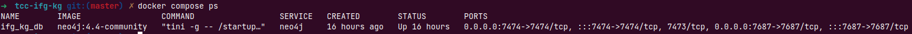
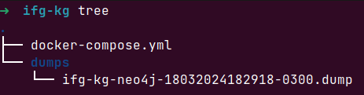

# Gerenciamento de _Dumps_

## O que é um _dump_ do banco de dados?

Um _dump_ de um banco de dados é essencialmente uma cópia completa de todo o conteúdo e estrutura do banco de dados. É como tirar uma fotografia de tudo o que está dentro do banco de dados naquele momento, para que, se algo der errado no banco de dados ou você queira transportar os dados de uma instância para outra, seja possível restaurá-lo para esse estado que a "fotografia" foi tirada.

## A ferramenta neo4j-admin

O Neo4j disponibiliza uma ferramenta que pode ser utilizada pela linha de comando, com essa ferramenta você pode realizar diversas operações de administração na instância do seu banco de dados, incluindo criar e restaurar _dumps_, para saber mais sobre essa ferramenta [clique aqui](https://neo4j.com/docs/operations-manual/4.4/tools/neo4j-admin/).

## Como criar um _dump_ do Neo4j?

O Neo4j na sua versão _Community_, utilizada neste projeto, não permite a criação de mais de um banco de dados, por isso na sua inicialização definimos uma variável de ambiente através do arquivo `docker-compose.yml` que define o nome do único banco de dados que a instância pode criar, esse nome é "ifg", quando vamos fazer o _dump_ precisamos especificar esse nome.

No caso desse projeto, já foi criado um script para realizar um _dump_ com facilidade, para utilizá-lo você pode executar o script que fica na raiz do projeto, com o seguinte comando:

```bash
./dump-neo4j.sh
```

Lembre-se de estar com o projeto executando de acordo com as instruções do [README](README.md#executar-localmente), para verificar se o contêiner do Neo4j está sendo executado você pode executar o seguinte comando na pasta raiz do projeto:

```bash
docker compose ps
```

A saída deve ser semelhante a esta:



Depois que o script for executado com sucesso o _dump_ estará na pasta `.docker/neo4j/dumps`, o formato do nome do arquivo é o seguinte:

Formato:

```
ifg-kg-neo4j-dump-[timestamp(DD-MM-AAAA-HH-MM-SS-timezone)].dump
```

Exemplo:

```
ifg-kg-neo4j-18032024182918-0300.dump
```

## Como restaurar um _dump_ do Neo4j?

Para restaurar um _dump_ você precisa de uma instância do Neo4j sendo executada, nessa documentação recomendamos a utilização do Docker para essa execução.

Para executar a instância utilizando Docker siga os seguintes passos:

1. Crie uma pasta para deixar os arquivos organizados e entre nela:

   ```bash
   mkdir ifg-kg && cd ifg-kg
   ```

2. Nessa pasta crie um arquivo nomeado `docker-compose.yml` e coloque nele o seguinte conteúdo:

   ```yaml
   services:
     neo4j:
       command: ["tail", "-f", "/dev/null"]
       image: neo4j:4.4-community
       ports:
         - "7474:7474"
         - "7687:7687"
       environment:
         NEO4J_dbms_default__database: ifg
         NEO4J_AUTH: neo4j/recover_dump
         TZ: America/Sao_Paulo
       volumes:
         - neo4j_data:/data
         - ./dumps/:/dumps/

   volumes:
     neo4j_data:
   ```

3. Dentro da pasta raiz crie uma pasta nomeada `dumps` e copie o dump para dentro dela, ficando assim:

   

4. Execute o contêiner do Neo4j:

   ```bash
   docker compose up -d neo4j
   ```

5. Execute o comando para restaurar o _dump_, substitua o `[arquivo_de_dump]` pelo nome completo do arquivo de _dump_ que deseja restaurar:

   ```bash
   docker compose exec neo4j neo4j-admin load --database=ifg --force --from=/dumps/[arquivo_de_dump]
   ```

6. Pare a execução do contêiner para podermos iniciar efetivamente o banco de dados (esse procedimento é necessário devido as limitações da versão _Community_):

   ```bash
   docker compose down neo4j
   ```

7. Remova a linha 3 do arquivo `docker-compose.yml`, a linha que especifica o `command` do serviço do Neo4j, deixando o arquivo assim:

   ```yaml
   services:
     neo4j:
       image: neo4j:4.4-community
       ports:
         - "7474:7474"
         - "7687:7687"
       environment:
         NEO4J_dbms_default__database: ifg
         NEO4J_AUTH: neo4j/recover_dump
         TZ: America/Sao_Paulo
       volumes:
         - neo4j_data:/data
         - ./dumps/:/dumps/

   volumes:
     neo4j_data:
   ```

8. Execute o contêiner do Neo4j novamente:

   ```bash
   docker compose up -d neo4j
   ```

9. No navegador acesse o endereço `http://localhost:7474` e acesse o banco utilizando as credenciais:

   - Usuário: `neo4j`
   - Senha: `recover_dump`

   ⚠️ **Observação**: Essas credenciais não são seguras, elas são apenas para você executar o Neo4j localmente e explorar os dados no seu computador, não siga essas instruções para executar um Neo4j em produção.

10. Realize as consultas desejadas, se precisar de ajuda consulte a [documentação do grafo](GRAPH_DOC.md).

## Referências

- [Neo4j Docs - Back up an offline database](https://neo4j.com/docs/operations-manual/4.4/backup-restore/offline-backup)

- [Neo4j Docs - Restore a database dump](https://neo4j.com/docs/operations-manual/4.4/backup-restore/restore-dump/)
