# Diagrama Estrutural do Grafo do Conhecimento do IFG

O presente documento apresenta o diagrama detalhado do Grafo do Conhecimento Acadêmico, construído a partir da estrutura semântica dos dados do Instituto Federal de Goiás (IFG). Esse grafo, armazenado no banco de dados [Neo4j](https://neo4j.com/docs/getting-started/get-started-with-neo4j/graph-database/), representa de forma visual e organizada as entidades e seus relacionamentos do ambiente acadêmico do IFG.

O diagrama abrange a estrutura do grafo, destacando os diferentes tipos de nós e suas propriedades (também podendo ser chamadas de atributos, um par de chave-valor), bem como os relacionamentos entre eles. Essa representação proporciona uma visão clara e abrangente da complexidade das informações acadêmicas, auxiliando na compreensão e análise dos dados.

Ao explorar esse diagrama juntamente com a documentação abaixo, é possível visualizar a interconexão entre cursos, disciplinas, docentes, discentes e demais elementos do ambiente acadêmico, contribuindo para uma melhor compreensão da estrutura melhor acessibilidade à escrita de consultas utilizando a linguagem [Cypher](<https://en.wikipedia.org/wiki/Cypher_(query_language)>).


[Clique aqui](.github/resources/diagram_documentation/main.svg) para ver o diagrama em uma nova aba.

## Estrutura da documentação

Apresente a estrutura da documentação, destacando os principais capítulos e seções. Isso ajudará o leitor a ter uma visão geral do conteúdo e a encontrar facilmente as informações de seu interesse.

## Recursos de Suporte

Informe sobre os recursos de suporte disponíveis para o leitor, como links para documentação adicional, fóruns de discussão, FAQs ou suporte técnico. Isso ajuda o leitor a encontrar ajuda adicional, caso necessário.

[neo4j data types](https://neo4j.com/docs/cypher-manual/4.4/values-and-types/)

## Documentação das entidades

### Unidade

Representa uma unidade do IFG com um codigo UASG, que identifica unicamente um órgão do Governo Federal.

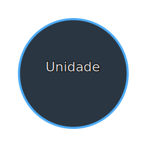

#### Rótulos

1. `Unidade`

#### Propriedades

| Nome       | Obrigatória | Tipo de Dado | Formato adicional    |
| ---------- | ----------- | ------------ | -------------------- |
| nome       | Sim         | String       |                      |
| sigla      | Sim         | String       |                      |
| logradouro | Não         | String       |                      |
| numero     | Não         | String       |                      |
| bairro     | Não         | String       |                      |
| cep        | Não         | String       | "00000-000"          |
| cidade     | Não         | String       |                      |
| site       | Sim         | String       |                      |
| telefone   | Sim         | String       | "(ddd) 0000-0000"    |
| email      | Sim         | String       | "xxxxx@ifg.edu.br"   |
| cnpj       | Sim         | String       | "00.000.000/0000-00" |
| uasg       | Sim         | String       |                      |

#### Consultas de exemplo

1. Buscando pela Unidade com a sigla "JAT":

   ```cypher
   MATCH (u:Unidade) WHERE u.sigla = 'JAT' RETURN u
   ```

### Servidor

É um rótulo auxiliar que atua como agrupador para os servidores federais presentes no grafo, sejam eles Docentes ou TAEs.

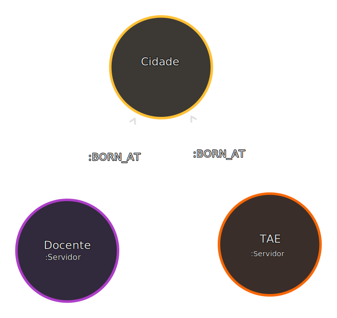

#### Relacionamentos

- **Servidor -[:BORN_AT]➔ Cidade**

  Cidade em que o Servidor nasceu.

#### Consultas de exemplo

1. Quantidade de Servidores registrados na Unidade de Anápolis:

   ```cypher
   MATCH (s:Servidor)-[:PART_OF]->(u:Unidade) WHERE u.sigla = 'ANA' RETURN count(s)
   ```

2. Quantidade de Servidores que nasceram em Goiânia:

   ```cypher
   MATCH (s:Servidor)-[:BORN_AT]->(c:Cidade)-[:PART_OF]->(uf:UnidadeFederativa) WHERE c.nome_ascii = 'goiania' AND uf.sigla = 'GO' RETURN count(s)
   ```

### Docente

Representa um docente efetivo, que obrigatóriamente possui uma matrícula SIAPE e neste caso está vinculado a alguma Unidade do IFG.

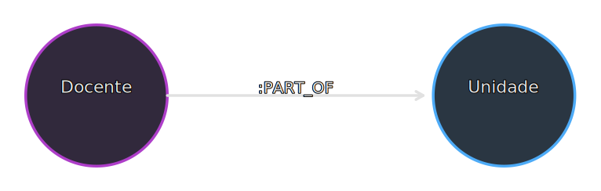

#### Rótulos

1. `Docente`
2. `Servidor`

#### Propriedades

| Nome                  | Obrigatória | Tipo de Dado |
| --------------------- | ----------- | ------------ |
| nome                  | Sim         | String       |
| matricula             | Sim         | Integer      |
| disciplina_ministrada | Sim         | String       |
| data_ingresso         | Não         | Date         |
| atribuicao            | Sim         | String       |
| carga_horaria         | Sim         | String       |

#### Relacionamentos

- **Docente -[:PART_OF]➔ Unidade**

  Docente que faz parte de uma Unidade.

#### Consultas de exemplo

1. Docente com a matrícula "1526346":

   ```cypher
   MATCH (d:Docente) WHERE d.matricula = 1526346 RETURN d
   ```

2. Docentes que possuem ligação com a Unidade de Jataí:

   ```cypher
   MATCH (d:Docente)-[:PART_OF]->(u:Unidade) WHERE u.sigla = 'JAT' RETURN d, u LIMIT 15
   ```

3. Quantidade de Docentes que ingressaram depois de 01/01/2000:

   ```cypher
   MATCH (d:Docente) WHERE d.data_ingresso > date('2000-01-01') RETURN count(d)
   ```

### Técnico Administrativo Educacional (TAE)

Representa um TAE, que obrigatóriamente possui uma matrícula SIAPE e neste caso está vinculado a alguma Unidade do IFG.

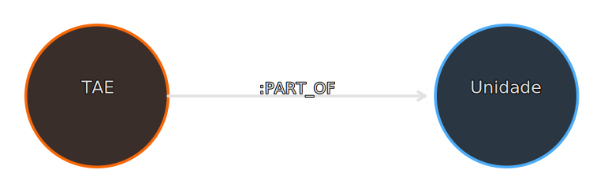

#### Rótulos

1. `TAE`
2. `Servidor`

#### Propriedades

| Nome          | Obrigatória | Tipo de Dado |
| ------------- | ----------- | ------------ |
| nome          | Sim         | String       |
| matricula     | Sim         | Integer      |
| data_ingresso | Sim         | Date         |
| atribuicao    | Sim         | String       |
| carga_horaria | Sim         | String       |

#### Relacionamentos

- **TAE -[:PART_OF]➔ Unidade**

  TAE que faz parte de uma Unidade.

#### Consultas de exemplo

1. TAE com a matrícula "2242502":

   ```cypher
   MATCH (t:TAE) WHERE t.matricula = 2242502 RETURN t
   ```

2. TAEs que possuem ligação com a Unidade de Jataí:

   ```cypher
   MATCH (t:TAE)-[:PART_OF]->(u:Unidade) WHERE u.sigla = 'JAT' RETURN t, u LIMIT 15
   ```

3. Quantidade de TAEs que ingressaram no ano de 2008:

   ```cypher
   MATCH (t:TAE) WHERE t.data_ingresso >= date('2008-01-01') AND t.data_ingresso <= date('2008-12-31') RETURN count(t)
   ```

### Curso

Representa um curso que é ofertado em uma Unidade.

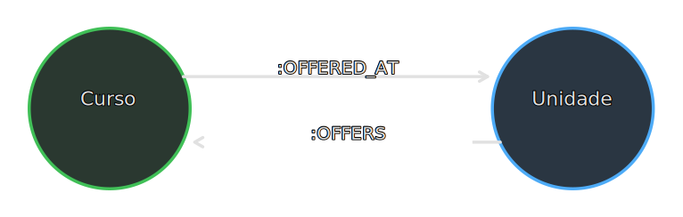

#### Rótulos

1. `Curso`

#### Propriedades

| Nome                | Obrigatória | Tipo de Dado |
| ------------------- | ----------- | ------------ |
| nome                | Sim         | String       |
| codigo              | Sim         | Integer      |
| modalidade          | Sim         | String       |
| formato             | Sim         | String       |
| turno               | Sim         | String       |
| periodo_de_ingresso | Sim         | String       |
| qtd_vagas_ano       | Sim         | Integer      |
| nivel               | Sim         | String       |
| ch_disciplinas      | Sim         | Integer      |
| ch_complementar     | Não         | Integer      |
| ch_estagio          | Não         | Integer      |
| ch_optativas        | Não         | Integer      |
| ch_projeto_final    | Não         | Integer      |
| ch_total            | Não         | Integer      |
| qtd_semestres       | Sim         | Integer      |

#### Relacionamentos

- **Curso -[:OFFERED_AT]➔ Unidade | Unidade -[:OFFERS]➔ Curso**

  Curso que é oferecido em uma Unidade, e vice versa.

#### Consultas de exemplo

1. Curso com o código "471" e em qual Unidade que é ofertado:

   ```cypher
   MATCH (c:Curso)-[:OFFERED_AT]->(u:Unidade) WHERE c.codigo = 471 RETURN c, u
   ```

2. Cursos ofertados pela Unidade de Jataí:

   ```cypher
   MATCH (u:Unidade)-[:OFFERS]->(c:Curso) WHERE u.sigla = 'JAT' RETURN c, u
   ```

3. Quantidade de Cursos de Ensino Médio ofertados em todas as Unidades:

   ```cypher
   MATCH (c:Curso) WHERE c.nivel = 'Ensino Médio' RETURN count(c)
   ```

### Disciplina

Representa uma Disciplina que é ministrada em um Curso.

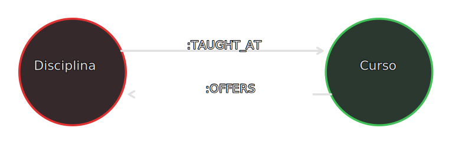

#### Rótulos

1. `Disciplina`

#### Propriedades

| Nome              | Obrigatória | Tipo de Dado |
| ----------------- | ----------- | ------------ |
| codigo            | Sim         | Integer      |
| periodo           | Sim         | Integer      |
| departamento      | Sim         | String       |
| nome              | Sim         | String       |
| carga_horaria     | Sim         | Integer      |
| sigla             | Sim         | String       |
| frequencia_oferta | Sim         | String       |

#### Relacionamentos

- **Disciplina -[:TAUGHT_AT]➔ Curso**

  Disciplina que é lecionada em um Curso.

- **Unidade -[:OFFERS]➔ Curso**

  Curso que oferta uma Disciplina.

#### Consultas de exemplo

1. O nome das Disciplinas lecionadas no curso de TADS da Unidade Jataí, ordenadas de maneira ascendente pelo período que são ofertadas:

   ```cypher
   MATCH (d:Disciplina)-[:TAUGHT_AT]->(c:Curso) WHERE c.codigo = 471 RETURN d.nome ORDER BY d.periodo
   ```

2. Quantas Disciplinas foram ofertadas nos Cursos da Unidade de Jataí:

   ```cypher
   MATCH (d:Disciplina)-[:TAUGHT_AT]->(c:Curso)-[:OFFERED_AT]->(u:Unidade) WHERE u.sigla = 'JAT' RETURN count(d)
   ```

3. Quantidades de Disciplinas de todas Unidades agrupadas por frequência de oferta:

   ```cypher
   MATCH (d:Disciplina) RETURN d.frequencia_oferta, count(d)
   ```

### Disciplina Ministrada

Enquanto a Disciplina representa uma definição, a Disciplina Ministrada representa uma
instância de Disciplina, que foi ministrada em algum ano/período, em algum Curso e por algum Docente.

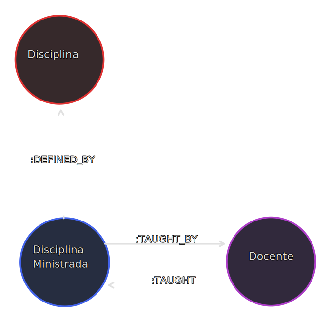

#### Rótulos

1. `DisciplinaMinistrada`

#### Propriedades

| Nome           | Obrigatória | Tipo de Dado |
| -------------- | ----------- | ------------ |
| codigo         | Sim         | Integer      |
| ano_letivo     | Sim         | Integer      |
| periodo_letivo | Sim         | Integer      |
| turma          | Não         | String       |

#### Relacionamentos

- **DisciplinaMinistrada -[:DEFINED_BY]➔ Disciplina**

  Os dados da Disciplina que constituem a definição da Disciplina que foi Ministrada.

- **DisciplinaMinistrada -[:TAUGHT_BY]➔ Docente**

  Disciplina que foi ministrada por um Docente.

  - Propriedades:

    | Nome         | Obrigatória | Tipo de Dado | Descrição                                |
    | ------------ | ----------- | ------------ | ---------------------------------------- |
    | as_auxiliary | Sim         | Boolean      | Indica se o Docente atuou como auxiliar. |

- **Docente -[:TAUGHT]➔ DisciplinaMinistrada**

  Docente que ministrou a Disciplina.

  - Propriedades:

    | Nome         | Obrigatória | Tipo de Dado | Descrição                                |
    | ------------ | ----------- | ------------ | ---------------------------------------- |
    | as_auxiliary | Sim         | Boolean      | Indica se o Docente atuou como auxiliar. |

#### Consultas de exemplo

1. Disciplinas Ministradas por Docentes aleatórios, juntamente com o Docente e a definição de cada uma dessas Disciplinas Ministradas:

   ```cypher
   MATCH (a:Docente)-[:TAUGHT]->(b:DisciplinaMinistrada)-[:DEFINED_BY]->(c:Disciplina) RETURN a, b, c LIMIT 20
   ```

2. Disciplinas Ministradas por Docentes, como docentes auxiliares:

   ```cypher
   MATCH (c:Disciplina)<-[:DEFINED_BY]-(a:DisciplinaMinistrada)-[r:TAUGHT_BY]->(b:Docente) WHERE r.as_auxiliary = true RETURN a, b, c LIMIT 20
   ```

3. Quantas vezes a Disciplina de Banco de Dados I do curso de TADS da Unidade de Formosa foi ministrada:

   ```cypher
   MATCH (dm:DisciplinaMinistrada)-[:DEFINED_BY]->(d:Disciplina)-[:TAUGHT_AT]->(c:Curso) WHERE c.codigo = 877 AND d.codigo = 21855 RETURN count(dm)
   ```

### Edital de Iniciação Científica

Representa um Edital de Iniciação Científica que foi sediado em alguma Unidade.

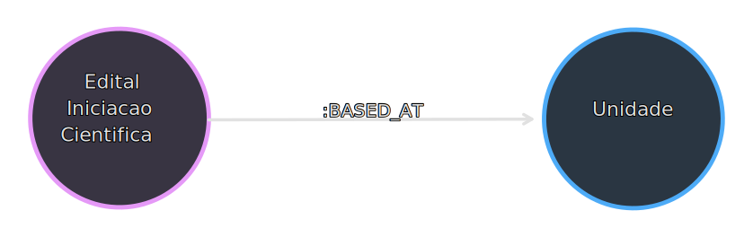

#### Rótulos

1. `EditalIniciacaoCientifica`

#### Propriedades

| Nome      | Obrigatória | Tipo de Dado | Formato Adicional |
| --------- | ----------- | ------------ | ----------------- |
| codigo    | Sim         | String       | UUIDv4            |
| ano       | Sim         | Integer      |                   |
| programas | Sim         | String       |                   |
| unidade   | Não         | String       |                   |
| descricao | Sim         | String       |                   |

#### Relacionamentos

- **EditalIniciacaoCientifica -[:BASED_AT]➔ Unidade**

  Edital de Iniciação Científica que foi sediado em uma unidade.

  - **Observações:**
    - Caso a propriedade "unidade" do Edital de Iniciação Científica esteja presente, este relacionamento não existirá.

#### Consultas de exemplo

1. Quantidade de Editais de Iniciação Científica agrupados por Unidades:

   ```cypher
   MATCH (eic:EditalIniciacaoCientifica)-[:BASED_AT]->(u:Unidade) RETURN u.sigla, count(eic)
   ```

2. Os Editais de Iniciação Científica que possuem a propriedade "unidade":

   ```cypher
   MATCH (eic:EditalIniciacaoCientifica) WHERE eic.unidade IS NOT NULL RETURN eic
   ```

### Discente

Representa um Discente que estudou/estuda no IFG.

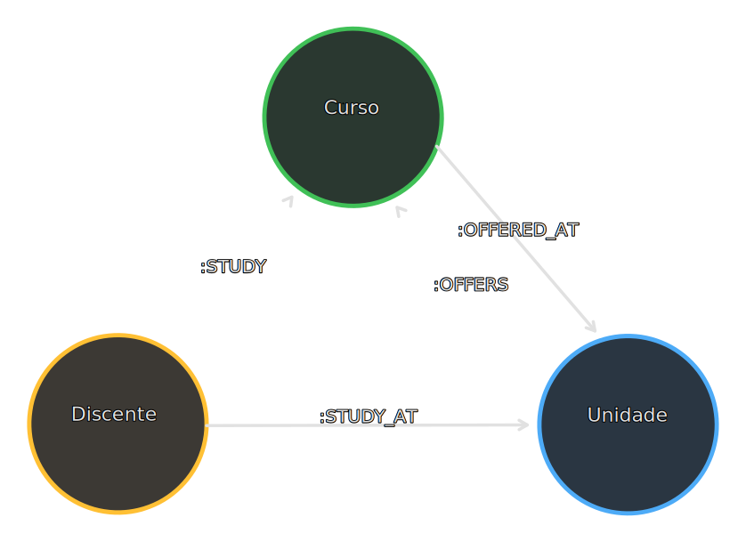

#### Rótulos

1. `Discente`

#### Propriedades

| Nome                      | Obrigatória | Tipo de Dado |
| ------------------------- | ----------- | ------------ |
| codigo                    | Sim         | String       |
| ano_ingresso              | Sim         | Integer      |
| periodo_letivo_ingresso   | Sim         | Integer      |
| nome_curso                | Não         | String       |
| modalidade                | Sim         | String       |
| formato                   | Sim         | String       |
| sexo                      | Sim         | String       |
| nivel                     | Sim         | String       |
| renda_familiar_per_capita | Não         | String       |
| etnia                     | Não         | String       |
| ano_nascimento            | Sim         | Integer      |
| situacao                  | Sim         | String       |

#### Relacionamentos

- **Discente -[:STUDY_AT]➔ Unidade**

  Em qual Unidade o Discente estudou/estuda.

- **Discente -[:STUDY]➔ Curso**

  Qual Curso o Discente cursa/cursou.

  - **Observações:**
    - Caso as propriedade "nome_curso" do Discente esteja presente, este relacionamento não existirá.

#### Consultas de exemplo

1. Quantidade de Discentes que não possuem ligação com um Curso:

   ```cypher
   MATCH (d:Discente) WHERE d.nome_curso IS NOT NULL RETURN count(d)
   ```

2. Situação e quantidade de Discentes do nível Superior, para cada situação, da unidade de Jataí, ordenados de maneira descendente:

   ```cypher
   MATCH (d:Discente)-[:STUDY_AT]->(u:Unidade) WHERE u.sigla = 'JAT' AND d.nivel = "Superior" RETURN d.situacao, count(d) as c ORDER BY c DESC
   ```

### Estágio Curricular

Representa um Estágio Curricular que foi realizado por algum discente durante a realização de algum Curso.

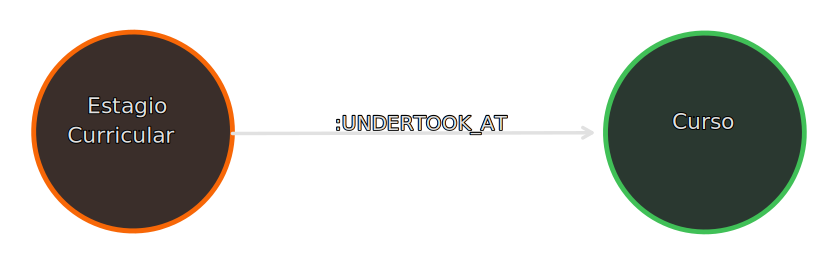

#### Rótulos

1. `EstagioCurricular`

#### Propriedades

| Nome              | Obrigatória | Tipo de Dado | Formato Adicional |
| ----------------- | ----------- | ------------ | ----------------- |
| codigo            | Sim         | String       | UUIDv4            |
| sigla_campus      | Não         | String       |                   |
| curso             | Não         | String       |                   |
| modalidade        | Sim         | String       |                   |
| nivel             | Sim         | String       |                   |
| data_inicio       | Sim         | Date         |                   |
| data_fim          | Não         | Date         |                   |
| data_relatorio    | Não         | Date         |                   |
| ofertante         | Sim         | String       |                   |
| status            | Sim         | String       |                   |
| tipo              | Sim         | String       |                   |
| remunerado        | Sim         | String       |                   |
| valor_remuneracao | Não         | Float        |                   |

#### Relacionamentos

- **EstagioCurricular -[:UNDERTOOK_AT]➔ Curso**

  Qual Curso o discente que realizou o estágio estava cursando.

  - **Observações:**
    - Caso as propriedades "sigla_campus" e "curso" do Estágio Curricular estejam presentes, este relacionamento não existirá.

#### Consultas de exemplo

1. O valor médio de remuneração dos estágios, agrupados por Unidade, de nível "Ensino Médio", de todos os tempos:

   ```cypher
   MATCH (ec:EstagioCurricular)-[:UNDERTOOK_AT]->(c:Curso)-[:OFFERED_AT]->(u:Unidade) WHERE ec.nivel = 'Ensino Médio' RETURN u.sigla, avg(ec.valor_remuneracao)
   ```

2. Quantidade de Estágios Curriculares que possuem a propriedade "curso":

   ```cypher
   MATCH (ec:EstagioCurricular) WHERE ec.curso IS NOT NULL RETURN count(ec)
   ```

3. Estágios Curriculares realizados por discentes que cursaram o Curso de Manutenção e Suporte em Informática na Unidade Jataí:

   ```
   MATCH (ec:EstagioCurricular)-[:UNDERTOOK_AT]->(c:Curso) WHERE c.codigo = 1028 RETURN ec, c
   ```

### Unidade Federativa

Representa uma Unidade Federativa do Brasil.

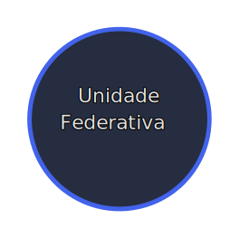

#### Rótulos

1. `UnidadeFederativa`

#### Propriedades

| Nome  | Obrigatória | Tipo de Dado |
| ----- | ----------- | ------------ |
| sigla | Sim         | String       |
| nome  | Sim         | String       |

#### Consultas de exemplo

1. O nome de todas as Unidades que o nome começa com a letra 'A':

   ```cypher
   MATCH (u:UnidadeFederativa) WHERE u.nome STARTS WITH 'A' RETURN u.nome
   ```

### Cidade

Representa uma Cidade que pode fazer parte de uma Unidade Federativa do Brasil.

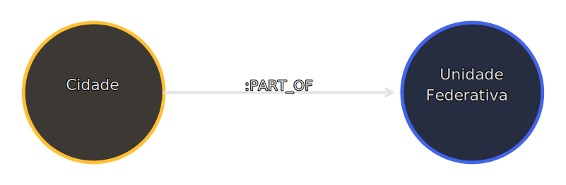

#### Rótulos

1. `Cidade`

#### Propriedades

| Nome       | Obrigatória | Tipo de Dado | Formato Adicional |
| ---------- | ----------- | ------------ | ----------------- |
| codigo     | Sim         | String       | UUIDv4            |
| nome       | Sim         | String       |                   |
| nome_ascii | Sim         | String       |                   |

#### Relacionamentos

- **Cidade -[:PART_OF]➔ UnidadeFederativa**

  Indica em qual Unidade Federativa do Brasil a cidade se localiza, caso a cidade não esteja localizada no Brasil esse relacionamento não existirá.

#### Consultas de exemplo

1. Nome das Cidades que não estão ligadas a uma Unidade Federativa:

   ```cypher
   MATCH (c:Cidade) WHERE NOT (c)-[:PART_OF]->(:UnidadeFederativa) RETURN c.nome
   ```

2. Quantidade de Cidades presentes por Unidade Federativa:

   ```cypher
   MATCH (c:Cidade)-[:PART_OF]->(uf:UnidadeFederativa) RETURN uf.sigla, count(c) as cnt ORDER BY cnt DESC
   ```

### Palavra-chave

Representa uma Palavra-chave que pode estar ligada a um Currículo.

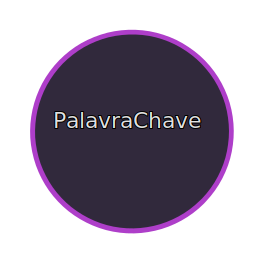

#### Rótulos

1. `PalavraChave`

#### Propriedades

| Nome    | Obrigatória | Tipo de Dado |
| ------- | ----------- | ------------ |
| palavra | Sim         | String       |
| correta | Sim         | String       |

#### Consultas de exemplo

1. 10 Palavras-chave aleatórias:

   ```cypher
   MATCH (pc:PalavraChave) RETURN pc.correta LIMIT 10
   ```

### Currículo

Representa Currículo que pode estar ligado a um Servidor (TAE ou Docente).

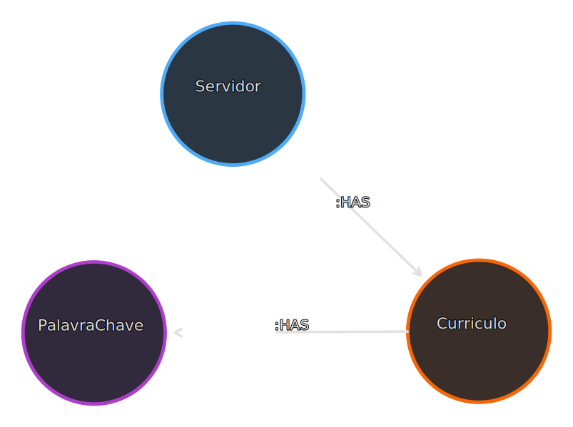

#### Rótulos

1. `Curriculo`

#### Propriedades

| Campo                        | Obrigatória | Tipo de Dado |
| ---------------------------- | ----------- | ------------ |
| codigo                       | Sim         | Integer      |
| aceitando_email              | Sim         | Boolean      |
| data_nascimento              | Não         | Date         |
| email                        | Sim         | String       |
| link                         | Não         | String       |
| nome_citacoes_bibliograficas | Sim         | String       |
| nome_completo                | Sim         | String       |
| nome_completo_sem_acento     | Sim         | String       |
| resumo                       | Não         | String       |

#### Relacionamentos

- **Servidor -[:HAS]➔ Curriculo**

  - **Observações:**
    - Nem todos os Servidores possuem um Currículo no grafo, pois os dados vieram de datasets diferentes.

- **Curriculo -[:HAS]➔ PalavraChave**
  As palavras chave que estão presentes algum Currículo.

#### Consultas de exemplo

1. 10 Currículos aleatórios ligados aos seus respectivos Servidores:

   ```cypher
   MATCH (c:Curriculo)<-[:HAS]-(s:Servidor) RETURN c, s LIMIT 10
   ```

2. A palavra-chave que mais aparece nos Currículos e quantas vezes ela foi utilizada:

   ```cypher
   MATCH (c:Curriculo)-[r:HAS]->(pc:PalavraChave) RETURN count(r) as incidência, pc.palavra as palavra ORDER BY incidência DESC LIMIT 1
   ```
