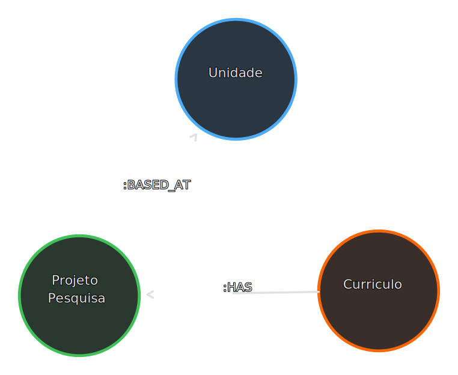
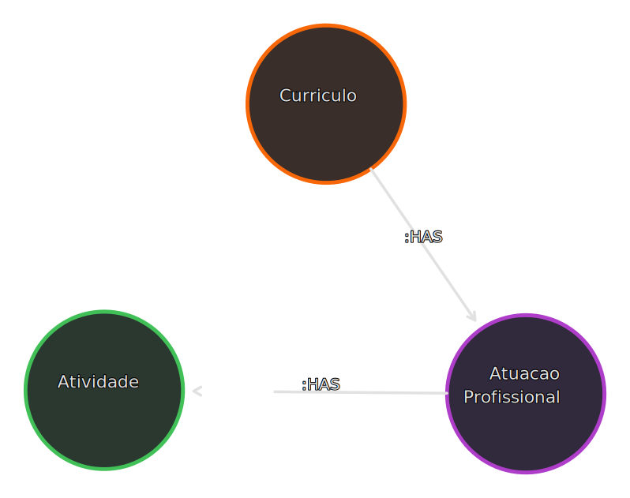
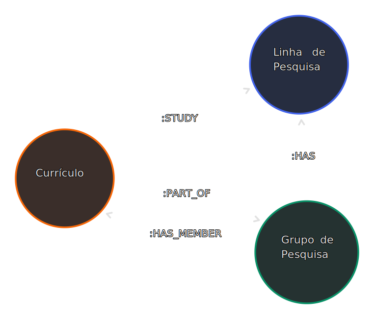

# Diagrama Estrutural do Grafo do Conhecimento do IFG

O presente documento apresenta o diagrama detalhado do Grafo do Conhecimento Acadêmico, construído a partir da estrutura semântica dos dados do Instituto Federal de Goiás (IFG). Esse grafo, armazenado no banco de dados [Neo4j](https://neo4j.com/docs/getting-started/get-started-with-neo4j/graph-database/), representa de forma visual e organizada as entidades e seus relacionamentos do ambiente acadêmico do IFG.

O diagrama abrange a estrutura do grafo, destacando os diferentes tipos de nós e suas propriedades (também podendo ser chamadas de atributos, um par de chave-valor), bem como os relacionamentos entre eles. Essa representação proporciona uma visão clara e abrangente da complexidade das informações acadêmicas, auxiliando na compreensão e análise dos dados.

Ao explorar esse diagrama juntamente com a documentação abaixo, é possível visualizar a interconexão entre cursos, disciplinas, docentes, discentes e demais elementos do ambiente acadêmico, contribuindo para uma melhor compreensão da estrutura melhor acessibilidade à escrita de consultas utilizando a linguagem [Cypher](<https://en.wikipedia.org/wiki/Cypher_(query_language)>).


[Clique aqui](.github/resources/diagram_documentation/main.svg) para ver o diagrama em uma nova aba.

## Estrutura da documentação

Apresente a estrutura da documentação, destacando os principais capítulos e seções. Isso ajudará o leitor a ter uma visão geral do conteúdo e a encontrar facilmente as informações de seu interesse.

## Recursos de Suporte

Informe sobre os recursos de suporte disponíveis para o leitor, como links para documentação adicional, fóruns de discussão, FAQs ou suporte técnico. Isso ajuda o leitor a encontrar ajuda adicional, caso necessário.

[neo4j data types](https://neo4j.com/docs/cypher-manual/4.4/values-and-types/)

## Documentação das entidades

### Unidade

Representa uma unidade do IFG com um codigo UASG, que identifica unicamente um órgão do Governo Federal.


#### Rótulos

1. `Unidade`

#### Propriedades

| Nome       | Obrigatória | Tipo de Dado | Formato adicional    |
| ---------- | ----------- | ------------ | -------------------- |
| nome       | Sim         | String       |                      |
| sigla      | Sim         | String       |                      |
| logradouro | Não         | String       |                      |
| numero     | Não         | String       |                      |
| bairro     | Não         | String       |                      |
| cep        | Não         | String       | "00000-000"          |
| cidade     | Não         | String       |                      |
| site       | Sim         | String       |                      |
| telefone   | Sim         | String       | "(ddd) 0000-0000"    |
| email      | Sim         | String       | "xxxxx@ifg.edu.br"   |
| cnpj       | Sim         | String       | "00.000.000/0000-00" |
| uasg       | Sim         | String       |                      |

#### Consultas de exemplo

1. Buscando pela Unidade com a sigla "JAT":

   ```cypher
   MATCH (u:Unidade) WHERE u.sigla = 'JAT' RETURN u
   ```

### Servidor

É um rótulo auxiliar que atua como agrupador para os servidores federais presentes no grafo, sejam eles Docentes ou TAEs.


#### Relacionamentos

- **Servidor -[:BORN_AT]➔ Cidade**

  Cidade em que o Servidor nasceu.

#### Consultas de exemplo

1. Quantidade de Servidores registrados na Unidade de Anápolis:

   ```cypher
   MATCH (s:Servidor)-[:PART_OF]->(u:Unidade) WHERE u.sigla = 'ANA' RETURN count(s)
   ```

2. Quantidade de Servidores que nasceram em Goiânia:

   ```cypher
   MATCH (s:Servidor)-[:BORN_AT]->(c:Cidade)-[:PART_OF]->(uf:UnidadeFederativa) WHERE c.nome_ascii = 'goiania' AND uf.sigla = 'GO' RETURN count(s)
   ```

### Docente

Representa um docente efetivo, que obrigatóriamente possui uma matrícula SIAPE e neste caso está vinculado a alguma Unidade do IFG.


#### Rótulos

1. `Docente`
2. `Servidor`

#### Propriedades

| Nome                  | Obrigatória | Tipo de Dado |
| --------------------- | ----------- | ------------ |
| nome                  | Sim         | String       |
| matricula             | Sim         | Integer      |
| disciplina_ministrada | Sim         | String       |
| data_ingresso         | Não         | Date         |
| atribuicao            | Sim         | String       |
| carga_horaria         | Sim         | String       |

#### Relacionamentos

- **Docente -[:PART_OF]➔ Unidade**

  Docente que faz parte de uma Unidade.

#### Consultas de exemplo

1. Docente com a matrícula "1526346":

   ```cypher
   MATCH (d:Docente) WHERE d.matricula = 1526346 RETURN d
   ```

2. Docentes que possuem ligação com a Unidade de Jataí:

   ```cypher
   MATCH (d:Docente)-[:PART_OF]->(u:Unidade) WHERE u.sigla = 'JAT' RETURN d, u LIMIT 15
   ```

3. Quantidade de Docentes que ingressaram depois de 01/01/2000:

   ```cypher
   MATCH (d:Docente) WHERE d.data_ingresso > date('2000-01-01') RETURN count(d)
   ```

### Técnico Administrativo Educacional (TAE)

Representa um TAE, que obrigatóriamente possui uma matrícula SIAPE e neste caso está vinculado a alguma Unidade do IFG.


#### Rótulos

1. `TAE`
2. `Servidor`

#### Propriedades

| Nome          | Obrigatória | Tipo de Dado |
| ------------- | ----------- | ------------ |
| nome          | Sim         | String       |
| matricula     | Sim         | Integer      |
| data_ingresso | Sim         | Date         |
| atribuicao    | Sim         | String       |
| carga_horaria | Sim         | String       |

#### Relacionamentos

- **TAE -[:PART_OF]➔ Unidade**

  TAE que faz parte de uma Unidade.

#### Consultas de exemplo

1. TAE com a matrícula "2242502":

   ```cypher
   MATCH (t:TAE) WHERE t.matricula = 2242502 RETURN t
   ```

2. TAEs que possuem ligação com a Unidade de Jataí:

   ```cypher
   MATCH (t:TAE)-[:PART_OF]->(u:Unidade) WHERE u.sigla = 'JAT' RETURN t, u LIMIT 15
   ```

3. Quantidade de TAEs que ingressaram no ano de 2008:

   ```cypher
   MATCH (t:TAE) WHERE t.data_ingresso >= date('2008-01-01') AND t.data_ingresso <= date('2008-12-31') RETURN count(t)
   ```

### Curso

Representa um curso que é ofertado em uma Unidade.


#### Rótulos

1. `Curso`

#### Propriedades

| Nome                | Obrigatória | Tipo de Dado |
| ------------------- | ----------- | ------------ |
| nome                | Sim         | String       |
| codigo              | Sim         | Integer      |
| modalidade          | Sim         | String       |
| formato             | Sim         | String       |
| turno               | Sim         | String       |
| periodo_de_ingresso | Sim         | String       |
| qtd_vagas_ano       | Sim         | Integer      |
| nivel               | Sim         | String       |
| ch_disciplinas      | Sim         | Integer      |
| ch_complementar     | Não         | Integer      |
| ch_estagio          | Não         | Integer      |
| ch_optativas        | Não         | Integer      |
| ch_projeto_final    | Não         | Integer      |
| ch_total            | Não         | Integer      |
| qtd_semestres       | Sim         | Integer      |

#### Relacionamentos

- **Curso -[:OFFERED_AT]➔ Unidade | Unidade -[:OFFERS]➔ Curso**

  Curso que é oferecido em uma Unidade, e vice versa.

#### Consultas de exemplo

1. Curso com o código "471" e em qual Unidade que é ofertado:

   ```cypher
   MATCH (c:Curso)-[:OFFERED_AT]->(u:Unidade) WHERE c.codigo = 471 RETURN c, u
   ```

2. Cursos ofertados pela Unidade de Jataí:

   ```cypher
   MATCH (u:Unidade)-[:OFFERS]->(c:Curso) WHERE u.sigla = 'JAT' RETURN c, u
   ```

3. Quantidade de Cursos de Ensino Médio ofertados em todas as Unidades:

   ```cypher
   MATCH (c:Curso) WHERE c.nivel = 'Ensino Médio' RETURN count(c)
   ```

### Disciplina

Representa uma Disciplina que é ministrada em um Curso.


#### Rótulos

1. `Disciplina`

#### Propriedades

| Nome              | Obrigatória | Tipo de Dado |
| ----------------- | ----------- | ------------ |
| codigo            | Sim         | Integer      |
| periodo           | Sim         | Integer      |
| departamento      | Sim         | String       |
| nome              | Sim         | String       |
| carga_horaria     | Sim         | Integer      |
| sigla             | Sim         | String       |
| frequencia_oferta | Sim         | String       |

#### Relacionamentos

- **Disciplina -[:TAUGHT_AT]➔ Curso**

  Disciplina que é lecionada em um Curso.

- **Unidade -[:OFFERS]➔ Curso**

  Curso que oferta uma Disciplina.

#### Consultas de exemplo

1. O nome das Disciplinas lecionadas no curso de TADS da Unidade Jataí, ordenadas de maneira ascendente pelo período que são ofertadas:

   ```cypher
   MATCH (d:Disciplina)-[:TAUGHT_AT]->(c:Curso) WHERE c.codigo = 471 RETURN d.nome ORDER BY d.periodo
   ```

2. Quantas Disciplinas foram ofertadas nos Cursos da Unidade de Jataí:

   ```cypher
   MATCH (d:Disciplina)-[:TAUGHT_AT]->(c:Curso)-[:OFFERED_AT]->(u:Unidade) WHERE u.sigla = 'JAT' RETURN count(d)
   ```

3. Quantidades de Disciplinas de todas Unidades agrupadas por frequência de oferta:

   ```cypher
   MATCH (d:Disciplina) RETURN d.frequencia_oferta, count(d)
   ```

### Disciplina Ministrada

Enquanto a Disciplina representa uma definição, a Disciplina Ministrada representa uma
instância de Disciplina, que foi ministrada em algum ano/período, em algum Curso e por algum Docente.


#### Rótulos

1. `DisciplinaMinistrada`

#### Propriedades

| Nome           | Obrigatória | Tipo de Dado |
| -------------- | ----------- | ------------ |
| codigo         | Sim         | Integer      |
| ano_letivo     | Sim         | Integer      |
| periodo_letivo | Sim         | Integer      |
| turma          | Não         | String       |

#### Relacionamentos

- **DisciplinaMinistrada -[:DEFINED_BY]➔ Disciplina**

  Os dados da Disciplina que constituem a definição da Disciplina que foi Ministrada.

- **DisciplinaMinistrada -[:TAUGHT_BY]➔ Docente**

  Disciplina que foi ministrada por um Docente.

  - Propriedades:

    | Nome         | Obrigatória | Tipo de Dado | Descrição                                |
    | ------------ | ----------- | ------------ | ---------------------------------------- |
    | as_auxiliary | Sim         | Boolean      | Indica se o Docente atuou como auxiliar. |

- **Docente -[:TAUGHT]➔ DisciplinaMinistrada**

  Docente que ministrou a Disciplina.

  - Propriedades:

    | Nome         | Obrigatória | Tipo de Dado | Descrição                                |
    | ------------ | ----------- | ------------ | ---------------------------------------- |
    | as_auxiliary | Sim         | Boolean      | Indica se o Docente atuou como auxiliar. |

#### Consultas de exemplo

1. Disciplinas Ministradas por Docentes aleatórios, juntamente com o Docente e a definição de cada uma dessas Disciplinas Ministradas:

   ```cypher
   MATCH (a:Docente)-[:TAUGHT]->(b:DisciplinaMinistrada)-[:DEFINED_BY]->(c:Disciplina) RETURN a, b, c LIMIT 20
   ```

2. Disciplinas Ministradas por Docentes, como docentes auxiliares:

   ```cypher
   MATCH (c:Disciplina)<-[:DEFINED_BY]-(a:DisciplinaMinistrada)-[r:TAUGHT_BY]->(b:Docente) WHERE r.as_auxiliary = true RETURN a, b, c LIMIT 20
   ```

3. Quantas vezes a Disciplina de Banco de Dados I do curso de TADS da Unidade de Formosa foi ministrada:

   ```cypher
   MATCH (dm:DisciplinaMinistrada)-[:DEFINED_BY]->(d:Disciplina)-[:TAUGHT_AT]->(c:Curso) WHERE c.codigo = 877 AND d.codigo = 21855 RETURN count(dm)
   ```

### Edital de Iniciação Científica

Representa um Edital de Iniciação Científica que foi sediado em alguma Unidade.


#### Rótulos

1. `EditalIniciacaoCientifica`

#### Propriedades

| Nome      | Obrigatória | Tipo de Dado | Formato Adicional |
| --------- | ----------- | ------------ | ----------------- |
| codigo    | Sim         | String       | UUIDv4            |
| ano       | Sim         | Integer      |                   |
| programas | Sim         | String       |                   |
| unidade   | Não         | String       |                   |
| descricao | Sim         | String       |                   |

#### Relacionamentos

- **EditalIniciacaoCientifica -[:BASED_AT]➔ Unidade**

  Edital de Iniciação Científica que foi sediado em uma unidade.

  - **Observações:**
    - Caso a propriedade "unidade" do Edital de Iniciação Científica esteja presente, este relacionamento não existirá.

#### Consultas de exemplo

1. Quantidade de Editais de Iniciação Científica agrupados por Unidades:

   ```cypher
   MATCH (eic:EditalIniciacaoCientifica)-[:BASED_AT]->(u:Unidade) RETURN u.sigla, count(eic)
   ```

2. Os Editais de Iniciação Científica que possuem a propriedade "unidade":

   ```cypher
   MATCH (eic:EditalIniciacaoCientifica) WHERE eic.unidade IS NOT NULL RETURN eic
   ```

### Discente

Representa um Discente que estudou/estuda no IFG.


#### Rótulos

1. `Discente`

#### Propriedades

| Nome                      | Obrigatória | Tipo de Dado |
| ------------------------- | ----------- | ------------ |
| codigo                    | Sim         | String       |
| ano_ingresso              | Sim         | Integer      |
| periodo_letivo_ingresso   | Sim         | Integer      |
| nome_curso                | Não         | String       |
| modalidade                | Sim         | String       |
| formato                   | Sim         | String       |
| sexo                      | Sim         | String       |
| nivel                     | Sim         | String       |
| renda_familiar_per_capita | Não         | String       |
| etnia                     | Não         | String       |
| ano_nascimento            | Sim         | Integer      |
| situacao                  | Sim         | String       |

#### Relacionamentos

- **Discente -[:STUDY_AT]➔ Unidade**

  Em qual Unidade o Discente estudou/estuda.

- **Discente -[:STUDY]➔ Curso**

  Qual Curso o Discente cursa/cursou.

  - **Observações:**
    - Caso as propriedade "nome_curso" do Discente esteja presente, este relacionamento não existirá.

#### Consultas de exemplo

1. Quantidade de Discentes que não possuem ligação com um Curso:

   ```cypher
   MATCH (d:Discente) WHERE d.nome_curso IS NOT NULL RETURN count(d)
   ```

2. Situação e quantidade de Discentes do nível Superior, para cada situação, da unidade de Jataí, ordenados de maneira descendente:

   ```cypher
   MATCH (d:Discente)-[:STUDY_AT]->(u:Unidade) WHERE u.sigla = 'JAT' AND d.nivel = "Superior" RETURN d.situacao, count(d) as c ORDER BY c DESC
   ```

### Estágio Curricular

Representa um Estágio Curricular que foi realizado por algum discente durante a realização de algum Curso.


#### Rótulos

1. `EstagioCurricular`

#### Propriedades

| Nome              | Obrigatória | Tipo de Dado | Formato Adicional |
| ----------------- | ----------- | ------------ | ----------------- |
| codigo            | Sim         | String       | UUIDv4            |
| sigla_campus      | Não         | String       |                   |
| curso             | Não         | String       |                   |
| modalidade        | Sim         | String       |                   |
| nivel             | Sim         | String       |                   |
| data_inicio       | Sim         | Date         |                   |
| data_fim          | Não         | Date         |                   |
| data_relatorio    | Não         | Date         |                   |
| ofertante         | Sim         | String       |                   |
| status            | Sim         | String       |                   |
| tipo              | Sim         | String       |                   |
| remunerado        | Sim         | String       |                   |
| valor_remuneracao | Não         | Float        |                   |

#### Relacionamentos

- **EstagioCurricular -[:UNDERTOOK_AT]➔ Curso**

  Qual Curso o discente que realizou o estágio estava cursando.

  - **Observações:**
    - Caso as propriedades "sigla_campus" e "curso" do Estágio Curricular estejam presentes, este relacionamento não existirá.

#### Consultas de exemplo

1. O valor médio de remuneração dos estágios, agrupados por Unidade, de nível "Ensino Médio", de todos os tempos:

   ```cypher
   MATCH (ec:EstagioCurricular)-[:UNDERTOOK_AT]->(c:Curso)-[:OFFERED_AT]->(u:Unidade) WHERE ec.nivel = 'Ensino Médio' RETURN u.sigla, avg(ec.valor_remuneracao)
   ```

2. Quantidade de Estágios Curriculares que possuem a propriedade "curso":

   ```cypher
   MATCH (ec:EstagioCurricular) WHERE ec.curso IS NOT NULL RETURN count(ec)
   ```

3. Estágios Curriculares realizados por discentes que cursaram o Curso de Manutenção e Suporte em Informática na Unidade Jataí:

   ```
   MATCH (ec:EstagioCurricular)-[:UNDERTOOK_AT]->(c:Curso) WHERE c.codigo = 1028 RETURN ec, c
   ```

### Unidade Federativa

Representa uma Unidade Federativa do Brasil.


#### Rótulos

1. `UnidadeFederativa`

#### Propriedades

| Nome  | Obrigatória | Tipo de Dado |
| ----- | ----------- | ------------ |
| sigla | Sim         | String       |
| nome  | Sim         | String       |

#### Consultas de exemplo

1. O nome de todas as Unidades que o nome começa com a letra 'A':

   ```cypher
   MATCH (u:UnidadeFederativa) WHERE u.nome STARTS WITH 'A' RETURN u.nome
   ```

### Cidade

Representa uma Cidade que pode fazer parte de uma Unidade Federativa do Brasil.


#### Rótulos

1. `Cidade`

#### Propriedades

| Nome       | Obrigatória | Tipo de Dado | Formato Adicional |
| ---------- | ----------- | ------------ | ----------------- |
| codigo     | Sim         | String       | UUIDv4            |
| nome       | Sim         | String       |                   |
| nome_ascii | Sim         | String       |                   |

#### Relacionamentos

- **Cidade -[:PART_OF]➔ UnidadeFederativa**

  Indica em qual Unidade Federativa do Brasil a cidade se localiza, caso a cidade não esteja localizada no Brasil esse relacionamento não existirá.

#### Consultas de exemplo

1. Nome das Cidades que não estão ligadas a uma Unidade Federativa:

   ```cypher
   MATCH (c:Cidade) WHERE NOT (c)-[:PART_OF]->(:UnidadeFederativa) RETURN c.nome
   ```

2. Quantidade de Cidades presentes por Unidade Federativa:

   ```cypher
   MATCH (c:Cidade)-[:PART_OF]->(uf:UnidadeFederativa) RETURN uf.sigla, count(c) as cnt ORDER BY cnt DESC
   ```

### Palavra-chave

Representa uma Palavra-chave que pode estar ligada a algum Currículo.


#### Rótulos

1. `PalavraChave`

#### Propriedades

| Nome    | Obrigatória | Tipo de Dado |
| ------- | ----------- | ------------ |
| palavra | Sim         | String       |
| correta | Sim         | String       |

#### Consultas de exemplo

1. 10 Palavras-chave aleatórias:

   ```cypher
   MATCH (pc:PalavraChave) RETURN pc.correta LIMIT 10
   ```

### Currículo

Representa Currículo que pode estar ligado a um Servidor (TAE ou Docente).


#### Rótulos

1. `Curriculo`

#### Propriedades

| Nome                         | Obrigatória | Tipo de Dado |
| ---------------------------- | ----------- | ------------ |
| codigo                       | Sim         | Integer      |
| aceitando_email              | Sim         | Boolean      |
| data_nascimento              | Não         | Date         |
| email                        | Sim         | String       |
| link                         | Não         | String       |
| nome_citacoes_bibliograficas | Sim         | String       |
| nome_completo                | Sim         | String       |
| nome_completo_sem_acento     | Sim         | String       |
| resumo                       | Não         | String       |

#### Relacionamentos

- **Servidor -[:HAS]➔ Curriculo**

  - **Observações:**
    - Nem todos os Servidores possuem um Currículo no grafo, pois os dados vieram de datasets diferentes.

- **Curriculo -[:HAS]➔ PalavraChave**
  As palavras chave que estão presentes em algum Currículo.

#### Consultas de exemplo

1. 10 Currículos aleatórios ligados aos seus respectivos Servidores:

   ```cypher
   MATCH (c:Curriculo)<-[:HAS]-(s:Servidor) RETURN c, s LIMIT 10
   ```

2. A palavra-chave que mais aparece nos Currículos e quantas vezes ocorreu sua aparição:

   ```cypher
   MATCH (c:Curriculo)-[r:HAS]->(pc:PalavraChave) RETURN count(r) as incidência, pc.palavra as palavra ORDER BY incidência DESC LIMIT 1
   ```

### Texto Jornal

Texto publicado em algum jornal/revista que consta em algum Currículo.


#### Rótulos

1. `TextoJornal`

#### Propriedades

| Nome     | Obrigatória | Tipo de Dado |
| -------- | ----------- | ------------ |
| codigo   | Sim         | Integer      |
| natureza | Sim         | String       |
| titulo   | Sim         | String       |
| ano      | Sim         | Integer      |

#### Relacionamentos

- **Curriculo -[:HAS]➔ TextoJornal**
  - Texto publicado em um jornal/revista que consta em algum Currículo.

#### Consultas de exemplo

1. 20 publicações aleatórias:

   ```cypher
   MATCH (tj:TextoJornal) RETURN tj LIMIT 20
   ```

2. Quantidade de publicações por ano ordenadas por ano com mais publicações:

   ```cypher
   MATCH (tj:TextoJornal) RETURN tj.ano, count(tj) as quantidade ORDER BY quantidade DESC
   ```

### Banca

Participação em Banca que consta em algum Currículo.


#### Rótulos

1. `Banca`

#### Propriedades

| Nome     | Obrigatória | Tipo de Dado |
| -------- | ----------- | ------------ |
| codigo   | Sim         | Integer      |
| natureza | Sim         | String       |
| titulo   | Sim         | String       |
| ano      | Sim         | Integer      |

#### Relacionamentos

- **Curriculo -[:PART_OF]➔ Banca**
  - Banca que o Currículo participou.

#### Consultas de exemplo

1. Quantidade de Bancas que Currículos de Servidores de Jataí participaram:

   ```cypher
   MATCH (b:Banca)<-[:PART_OF]-(c:Curriculo)<-[:HAS]-(s:Servidor)-[:PART_OF]->(u:Unidade) WHERE u.sigla = 'JAT' RETURN count(b)
   ```

2. Quantidade de Bancas por ano e qual ano teve mais bancas participadas:

   ```cypher
   MATCH (b:Banca) RETURN b.ano, count(b) as ano ORDER BY ano DESC
   ```

### Registro

Registro de patente que consta algum Currículo.


#### Rótulos

1. `Registro`

#### Propriedades

| Nome   | Obrigatória | Tipo de Dado |
| ------ | ----------- | ------------ |
| codigo | Sim         | Integer      |
| nome   | Sim         | String       |
| tipo   | Sim         | String       |
| ano    | Sim         | Integer      |

#### Relacionamentos

- **Curriculo -[:HAS]➔ Registro**
  - Registro de patente que consta em algum Currículo.

#### Consultas de exemplo

1. O cinco Servidores que possuem mais Registros de patente:

   ```cypher
   MATCH (reg:Registro)<-[r:HAS]-(c:Curriculo)<-[:HAS]-(s:Servidor) RETURN s.nome, s.matricula, s.atribuicao, count(r) as qtd_registros ORDER BY qtd_registros DESC LIMIT 5
   ```

### Participação em Evento

Participação em algum evento que consta em algum Currículo.


#### Rótulos

1. `ParticipacaoEvento`

#### Propriedades

| Nome                  | Obrigatória | Tipo de Dado |
| --------------------- | ----------- | ------------ |
| codigo                | Sim         | Integer      |
| titulo                | Não         | String       |
| ano                   | Sim         | Integer      |
| natureza              | Sim         | String       |
| tipo                  | Não         | String       |
| forma                 | Não         | String       |
| divulgacao_cientifica | Não         | Boolean      |

#### Relacionamentos

- **Curriculo -[:HAS]➔ ParticipacaoEvento**
  - Participação em um evento que consta em algum Currículo.

#### Consultas de exemplo

1. 5 anos que mais houveram Participações:

   ```cypher
   MATCH (pe:ParticipacaoEvento)<-[:HAS]-(c:Curriculo) RETURN pe.ano, count(pe) as qtd_participacoes ORDER BY qtd_participacoes DESC LIMIT 5
   ```

### Projeto de Pesquisa

Projeto de Pesquisa que consta em algum Currículo.



#### Rótulos

1. `ProjetoPesquisa`

#### Propriedades

| Nome                     | Obrigatória | Tipo de Dado |
| ------------------------ | ----------- | ------------ |
| codigo                   | Sim         | Integer      |
| nome                     | Sim         | String       |
| descricao                | Não         | String       |
| ano_inicio               | Sim         | Integer      |
| ano_termino              | Não         | Integer      |
| financiador_projeto      | Não         | String       |
| instituicao_financiadora | Não         | String       |
| orgao                    | Não         | String       |

#### Relacionamentos

- **Curriculo -[:HAS]➔ ProjetoPesquisa**

  - Projeto de Pesquisa que consta em algum Currículo.

- **ProjetoPesquisa -[:BASED_AT]➔ Unidade**
  - Em qual(is) Unidade(s) o Projeto de Pesquisa foi sediado.

#### Consultas de exemplo

1. Projetos de pesquisa que foram sediados em mais de uma Unidade:

   ```cypher
   MATCH (pp:ProjetoPesquisa)-[:BASED_AT]->(u:Unidade)
   WITH pp, COUNT(DISTINCT u) as numUnidades
   WHERE numUnidades > 1
   MATCH (pp:ProjetoPesquisa)-[:BASED_AT]->(u:Unidade)
   RETURN pp, u
   ```

2. O Currículo que possui mais Projetos de Pesquisa, qual a quantidade de Projetos encontrados e qual o link para o Currículo:

   ```cypher
   MATCH (pp:ProjetoPesquisa)<-[:HAS]-(c:Curriculo) RETURN c.link, count(pp) as qtd_projetos_pesquisa ORDER BY qtd_projetos_pesquisa DESC LIMIT 1
   ```

### Orientação

Orientação que consta em algum Currículo.


#### Rótulos

1. `Orientacao`

#### Propriedades

| Nome           | Obrigatória | Tipo de Dado |
| -------------- | ----------- | ------------ |
| codigo         | Sim         | Integer      |
| tipo           | Sim         | String       |
| titulo         | Sim         | String       |
| ano            | Sim         | Integer      |
| nome_orientado | Não         | String       |
| concluida      | Sim         | Boolean      |

#### Relacionamentos

- **Curriculo -[:HAS]➔ Orientacao**

  - Orientação que consta em algum Currículo.

#### Consultas de exemplo

1. Quantidade de Orientações concluídas e não concluídas:

   ```cypher
   MATCH(c:Orientacao) RETURN c.concluida, count(c)
   ```

### Atuação Profissional

Atuação Profissional que consta em algum Currículo.


#### Rótulos

1. `AtuacaoProfissional`

#### Propriedades

| Nome                | Obrigatória | Tipo de Dado |
| ------------------- | ----------- | ------------ |
| codigo              | Sim         | Integer      |
| nome_da_instituicao | Sim         | String       |
| ano_trabalho        | Não         | Integer      |

#### Relacionamentos

- **Curriculo -[:HAS]➔ AtuacaoProfissional**

  - Atuação Profissional que consta em algum Currículo.

#### Consultas de exemplo

1. Quantidade de Atuações Profissionais sem ano de trabalho definido:

   ```cypher
   MATCH (ap:AtuacaoProfissional) WHERE ap.ano_trabalho IS NULL RETURN count(ap)
   ```

### Atuação Profissional

Atuação Profissional que consta em algum Currículo.


#### Rótulos

1. `AtuacaoProfissional`

#### Propriedades

| Nome                | Obrigatória | Tipo de Dado |
| ------------------- | ----------- | ------------ |
| codigo              | Sim         | Integer      |
| nome_da_instituicao | Sim         | String       |
| ano_trabalho        | Não         | Integer      |

#### Relacionamentos

- **Curriculo -[:HAS]➔ AtuacaoProfissional**

  - Atuação Profissional que consta em algum Currículo.

#### Consultas de exemplo

1. Quantidade de Atuações Profissionais sem ano de trabalho definido:

   ```cypher
   MATCH (ap:AtuacaoProfissional) WHERE ap.ano_trabalho IS NULL RETURN count(ap)
   ```

### Atividade

Atividade que era executada durante o exercício de uma Atuação Profissional.



#### Rótulos

1. `Atividade`

#### Propriedades

| Nome       | Obrigatória | Tipo de Dado |
| ---------- | ----------- | ------------ |
| codigo     | Sim         | Integer      |
| ano_inicio | Sim         | Integer      |
| cargo      | Sim         | String       |

#### Relacionamentos

- **AtuacaoProfissional -[:HAS]➔ Atividade**

  - Atividade que era executada durante uma Atuação Profissional.

#### Consultas de exemplo

1. 10 Atividades com suas respectivas Atuações Profissionais e Currículos:

   ```cypher
   MATCH (at:Atividade)<-[:HAS]-(ap:AtuacaoProfissional)<-[:HAS]-(c:Curriculo) RETURN at, ap, c LIMIT 10
   ```

### Produção Técnica

Produção Técnica que consta em algum Currículo.


#### Rótulos

1. `ProducaoTecnica`

#### Propriedades

| Nome       | Obrigatória | Tipo de Dado |
| ---------- | ----------- | ------------ |
| codigo     | Sim         | Integer      |
| nome       | Sim         | String       |
| ano        | Sim         | Integer      |
| natureza   | Não         | String       |
| finalidade | Não         | String       |

#### Relacionamentos

- **Curriculo -[:HAS]➔ ProducaoTecnica**

  - Produção Técnica que consta em algum Currículo.

#### Consultas de exemplo

1. Quantidade de Produções Técnicas agrupadas por Unidade, com a quantidade ordenada de forma decrescente:

   ```cypher
   MATCH (pt:ProducaoTecnica)<-[:HAS]-(c:Curriculo)<-[:HAS]-(s:Servidor)-[:PART_OF]->(u:Unidade) RETURN u.sigla, count(pt) as qtd_producoes ORDER BY qtd_producoes DESC
   ```

2. Quantidade de Produções Técnicas agrupadas por ano, a quantidade ordenada de forma decrescente:

   ```cypher
   MATCH (pt:ProducaoTecnica)<-[:HAS]-(c:Curriculo)<-[:HAS]-(s:Servidor)-[:PART_OF]->(u:Unidade) RETURN pt.ano, count(pt) as qtd_producoes ORDER BY qtd_producoes DESC
   ```

### Outra Produção

Outra Produção que consta em algum Currículo.


#### Rótulos

1. `OutraProducao`

#### Propriedades

| Nome               | Obrigatória | Tipo de Dado |
| ------------------ | ----------- | ------------ |
| codigo             | Sim         | Integer      |
| nome               | Sim         | String       |
| ano                | Sim         | Integer      |
| natureza           | Não         | String       |
| tipo               | Sim         | String       |
| meio_de_divulgacao | Não         | String       |

#### Relacionamentos

- **Curriculo -[:HAS]➔ OutraProducao**

  - Outra Produção que consta em algum Currículo.

#### Consultas de exemplo

1. Quantidade de Outras Produções por Currículo, ordenada de maneira descendente:

   ```cypher
   MATCH (c:Curriculo)-[:HAS]->(op:OutraProducao)
   RETURN c.link, c.nome_completo, COUNT(op) AS numProducoes
   ORDER BY numProducoes DESC
   ```

### Área de Atuação

Área de Atuação que consta em algum Currículo.


#### Rótulos

1. `AreaAtuacao`

#### Propriedades

| Nome                     | Obrigatória | Tipo de Dado |
| ------------------------ | ----------- | ------------ |
| codigo                   | Sim         | Integer      |
| grande_area_conhecimento | Sim         | String       |
| especialidade            | Não         | String       |
| area_do_conhecimento     | Não         | String       |
| subarea_do_conhecimento  | Não         | String       |

#### Relacionamentos

- **Curriculo -[:HAS]➔ AreaAtuacao**

  - Área de Atuação que consta em algum Currículo.

#### Consultas de exemplo

1. Quantidade de áreas do conhecimento distintas que existem no grafo:

   ```cypher
   MATCH (a:AreaAtuacao) RETURN count(DISTINCT a.area_do_conhecimento)
   ```

### Formação Acadêmica

Formação Acadêmica que consta em algum Currículo.


#### Rótulos

1. `FormacaoAcademica`

#### Propriedades

| Nome             | Obrigatória | Tipo de Dado |
| ---------------- | ----------- | ------------ |
| codigo           | Sim         | Integer      |
| nome_instituicao | Não         | String       |
| nome_curso       | Não         | String       |
| ano_inicio       | Sim         | Integer      |
| ano_conclusao    | Não         | Integer      |
| status_curso     | Sim         | String       |

#### Relacionamentos

- **Curriculo -[:HAS]➔ FormacaoAcademica**

  - Formação Acadêmica que consta em algum Currículo.

- **FormacaoAcademica -[:AT]➔ Unidade**

  Em qual Unidade a Formação Acadêmica foi ou está sendo realizada.

  - **Observações:**
    - Caso a propriedade "nome_instituicao" da Formação Acadêmica esteja presente, este relacionamento não existirá.

#### Consultas de exemplo

1. Formações Acadêmicas realizadas/em andamento na Unidade de Jataí:

   ```cypher
   MATCH (c:Curriculo)-[:HAS]->(fa:FormacaoAcademica)-[:AT]->(u:Unidade) WHERE u.sigla = 'JAT' RETURN fa, u, c
   ```

2. Quantidade de Formações Acadêmicas iniciadas a partir do ano 2000 agrupadas pelo seu status:

   ```cypher
   MATCH (fa:FormacaoAcademica) WHERE fa.ano_inicio >= 2000 RETURN fa.status_curso, count(fa)
   ```

### Conferência

Definição de uma Conferência.


#### Rótulos

1. `Conferencia`

#### Propriedades

| Nome   | Obrigatória | Tipo de Dado |
| ------ | ----------- | ------------ |
| codigo | Sim         | Integer      |
| sigla  | Sim         | String       |
| nome   | Sim         | String       |
| qualis | Sim         | String       |

#### Consultas de exemplo

1. Quantidade de Conferências onde o qualis é "A1":

   ```cypher
   MATCH (c:Conferencia) WHERE c.qualis = 'A1' RETURN count(c)
   ```

2. O nome da Conferência que possui a sigla "AAAI":

   ```cypher
   MATCH (c:Conferencia) WHERE c.sigla = 'AAAI' RETURN c.nome
   ```

### Revista

Definição de uma Revista.


#### Rótulos

1. `Revista`

#### Propriedades

| Nome            | Obrigatória | Tipo de Dado |
| --------------- | ----------- | ------------ |
| codigo          | Sim         | Integer      |
| nome            | Sim         | String       |
| qualificacao    | Sim         | String       |
| area_de_atuacao | Sim         | String       |
| issn            | Sim         | String       |

#### Consultas de exemplo

1. Quantidade de Revista onde q qualificação é "A1":

   ```cypher
   MATCH (r:Revista) WHERE r.qualificacao = 'A1' RETURN count(r)
   ```

2. O nome da Conferência que possui o ISSN "0026-9247":

   ```cypher
   MATCH (r:Revista) WHERE r.issn = '0026-9247' RETURN DISTINCT r.nome
   ```

### Produção Bibliográfica

Uma Produção Bibliográfica que pode estar ligada a uma Revista ou a uma Conferência.


#### Rótulos

1. `ProducaoBibliografica`

#### Propriedades

| Nome                    | Obrigatória | Tipo de Dado |
| ----------------------- | ----------- | ------------ |
| codigo                  | Sim         | Integer      |
| doi_producao            | Não         | String       |
| natureza                | Não         | String       |
| ano                     | Sim         | Integer      |
| idioma                  | Sim         | String       |
| tipo                    | Não         | String       |
| titulo                  | Sim         | String       |
| classificacao_do_evento | Não         | String       |
| meio_divulgacao         | Não         | String       |

#### Relacionamentos

- **Curriculo -[:HAS]➔ ProducaoBibliografica**

  - Publicação Bibliográfica que consta em algum Currículo.

- **ProducaoBibliografica -[:PRESENTED_AT]➔ Revista**

  Produção Bibliográfica que foi apresentada em uma Revista.

- **ProducaoBibliografica -[:PRESENTED_AT]➔ Conferencia**

  Produção Bibliográfica que foi apresentada em uma Conferência.

#### Consultas de exemplo

1. 10 Currículos que mais possuem Produções Bibliográficas:

   ```cypher
   MATCH (pb:ProducaoBibliografica)<-[:HAS]-(c:Curriculo)
   RETURN count(pb) as qtd_producoes_bibliograficas, c.nome_completo
   ORDER BY qtd_producoes_bibliograficas DESC
   LIMIT 10
   ```

2. Quantidade de Produções Bibliográficas que foram publicadas em Revistas e em Conferências:

   ```cypher
   MATCH (pb:ProducaoBibliografica)-[:PRESENTED_AT]->(r:Revista)
   WITH count(pb) as publicadasEmRevista
   MATCH (pb:ProducaoBibliografica)-[:PRESENTED_AT]->(c:Conferencia)
   WITH publicadasEmRevista, count(pb) as publicadasEmConferencia
   RETURN publicadasEmRevista, publicadasEmConferencia
   ```

### Linha de Pesquisa

A definição de uma Linha de Pesquisa.


#### Rótulos

1. `LinhaPesquisa`

#### Propriedades

| Nome   | Obrigatória | Tipo de Dado |
| ------ | ----------- | ------------ |
| codigo | Sim         | Integer      |
| titulo | Sim         | String       |

#### Relacionamentos

- **Curriculo -[:STUDY]➔ LinhaPesquisa**

  - A Linha de Pesquisa estudada pelo pesquisador, que consta no Currículo.

#### Consultas de exemplo

1. 20 Linhas de Pesquisas aleatórias juntamente com seus Currículos que as estudam:

   ```cypher
   MATCH (lp:LinhaPesquisa)<-[:STUDY]-(c:Curriculo) RETURN lp, c LIMIT 20
   ```

### Grupo de Pesquisa

A definição de um Grupo de Pesquisa.



#### Rótulos

1. `GrupoPesquisa`

#### Propriedades

| Nome                   | Obrigatória | Tipo de Dado |
| ---------------------- | ----------- | ------------ |
| codigo                 | Sim         | Integer      |
| ano_formacao           | Sim         | Integer      |
| link                   | Sim         | String       |
| nome                   | Sim         | String       |
| nome_lider             | Não         | String       |
| situacao               | Sim         | String       |
| situacao_por_criterios | Sim         | String       |

#### Relacionamentos

- **Curriculo -[:PART_OF]➔ GrupoPesquisa**

  - O Grupo de Pesquisa que consta no Currículo do pesquisador que ele faz parte.

- **GrupoPesquisa -[:HAS_MEMBER]➔ Curriculo**

  - Indica que o Grupo de Pesquisa possui como membro o pesquisador ao qual pertence o Currículo.

- **GrupoPesquisa -[:STUDY]➔ LinhaPesquisa**

  - Indica uma Linha de Pesquisa que o Grupo de Pesquisa estuda.

#### Consultas de exemplo

1. Currículos dos pesquisadores que fazem parte de um Grupo de Pesquisa:

   ```cypher
   MATCH (c:Curriculo)-[:PART_OF]->(gp:GrupoPesquisa) RETURN c, gp LIMIT 30
   ```

2. Linhas de Pesquisa que Grupos de Pesquisa aleatórios estudam:

   ```cypher
   MATCH (gp:GrupoPesquisa)-[:STUDY]->(lp:LinhaPesquisa) RETURN gp, lp LIMIT 30
   ```

### Discente participante de um Grupo de Pesquisa

A definição de um Discente participante de um Grupo de Pesquisa. Este Discente não é o mesmo que foi citado anteriormente, são dados diferentes, esse é mais específico.


#### Rótulos

1. `DiscenteGrupoPesquisa`

#### Propriedades

| Nome   | Obrigatória | Tipo de Dado |
| ------ | ----------- | ------------ |
| codigo | Sim         | Integer      |
| nome   | Sim         | String       |

#### Relacionamentos

- **DiscenteGrupoPesquisa -[:PART_OF]➔ GrupoPesquisa**

  - Indica a relação de um DiscenteGrupoPesquisa que participa de um Grupo de Pesquisa.

- **GrupoPesquisa -[:HAS_MEMBER]➔ DiscenteGrupoPesquisa**

  - Indica que o Grupo de Pesquisa possui como membro um DiscenteGrupoPesquisa.

#### Consultas de exemplo

1. DiscentesGrupoPesquisa que fazem parte de Grupos de Pesquisa aleatórios:

   ```cypher
   MATCH (dgp:DiscenteGrupoPesquisa)-[:PART_OF]->(gp:GrupoPesquisa) RETURN dgp, gp LIMIT 50
   ```
